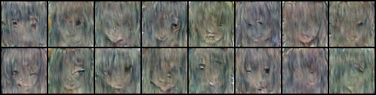

# ***diffusion***极简化版代码解读

## diffusion核心原理

1. **前向过程**：将输入图像由X0逐步添加噪声变成Xt
2. **反向过程**：训练一个神经网络，用来把噪声回复乘原始图像
3. **损失函数**：通过前向过程的数据，让模型预测每一步的噪声，和原高斯噪声对比，计算loss

> 人话来说，就是让模型学会将输入的噪声恢复成一个图像的做法

## 1.定义噪声调度

```py
import torch
import torch.nn as nn

# 定义扩散的总步数（如1000步）
timesteps = 1000

# 生成 beta 的线性调度（控制每一步噪声的强度）
betas = torch.linspace(start=1e-4, end=0.02, steps=timesteps)

# 计算 alpha 和 alpha 的累积乘积（用于闭式公式）
a = 1. - betas
a_lc = torch.lc(a, dim=0)  # 形状：(timesteps,)
sqrt_a0_lc = torch.sqrt(a_lc)  # 用于前向过程
sqrt_a1_lc = torch.sqrt(1. - a_lc)  # 用于前向过程
```

```python
'''
1.beta(β)  是0.0001到0.02的线性增长序列，控制每一步的噪声量
2.a(α) 由β生成a是线性递减的，所以需要1减去b。
3.a_lc  为a的累乘
4.剩下两个是根号下(α) 和根号下(1-α)
'''
```

## 2.前向扩散

1. <span style="background-color: rgb(123, 209, 245);">**是什么**</span>：给定原始图像x0和时间步t，通过公式直接计算得到xt，时间步嵌入实际上是为了让模型理解现在扩散进行到哪一步了
3. <span style="background-color: rgb(123, 209, 245);">**怎么做**</span>：

$$
x_t = \sqrt{\bar{\alpha}_t} \cdot x_0 + \sqrt{1 - \bar{\alpha}_t} \cdot \epsilon
$$

​		x0到xt公式

​		**其中：**
$$
\bar{\alpha}_t = \prod_{s=1}^t \alpha_s
$$

$$
\alpha_t = 1 - \beta_t
$$

$$
\epsilon \sim \mathcal{N}(0, I)
$$

​		分别表示：a的累乘，a的生成，噪声为高斯噪声

​		不需要完全了解这个公式，只需要注意到xt和x0随着t的增加在不断减小就好了，最终函数**forward_diffusion**返回的是噪声和t步加噪之后的图像

```python
def forward_diffusion(x0, t, sqrt_a0_lc, sqrt_a1_lc):
    # 生成与 x0 相同形状的噪声
    noise = torch.randn_like(x0)
    
    # 从调度表中获取对应时间步的系数
    sqrt_a0 = sqrt_a0_lc[t].reshape(-1, 1, 1, 1)  # 保持维度一致
    sqrt_a1 = sqrt_a1_lc[t].reshape(-1, 1, 1, 1)
    
    # 计算加噪后的图像（闭式公式）
    xt = sqrt_a0 * x0 + sqrt_a1 * noise
    
    return xt, noise  # 返回加噪结果和噪声
```

```python
# noise生成的是和x0相同形状的高斯噪声

# reshape调整维度，用来和x0进行计算
#通过公式，计算出a和1-a的累乘

#最后，使用公式直接计算出xt的数据，包含了batch_size的t次加噪图像
```

## 3.**UNet**模型的定义

1. <span style="background-color: rgb(123, 209, 245);">**是什么**</span>：使用UNet模型进行预测噪声

   ​		通过预测的噪声，反向去除**噪声**，获得假的原始图片。


​	**时间步嵌入**

```py
class TimeEmbedding(nn.Module):
    """时间步嵌入：将整数时间步 t 转换为向量"""
    def __init__(self, embed_dim=256):
        super().__init__()
        self.embed = nn.Sequential(
            nn.Linear(1, embed_dim),  # 输入是时间步 t（标量），输出 embed_dim 维向量
            nn.SiLU(),                # 激活函数
            nn.Linear(embed_dim, embed_dim)
        )

    def forward(self, t):
        # 输入 t 的形状：(batch_size,)
        t = t.float().view(-1, 1)  # 转为 (batch_size, 1)
        t_embed = self.embed(t)    # 输出 (batch_size, embed_dim)
        return t_embed
```

``` python
# 将时间步T映射成一个256维度的向量。
# 最后输出形状为 (batch_size,256),依照上面代码形状
```


​	**下采样模块**

```python
class DownBlock(nn.Module):
    """下采样模块：每次降低分辨率，并提取特征"""
    def __init__(self, in_channels, out_channels, t):
        super().__init__()
        # 时间嵌入的线性变换：调整维度以匹配特征图
        # 这里的t不是具体的时间步，是一个尺寸，用来定义函数
        self.time_mlp = nn.Linear(t, out_channels)
        
        # 卷积块：两次卷积 + 激活函数
        self.conv = nn.Sequential(
            nn.Conv2d(in_channels, out_channels,3, padding=1),
            nn.GroupNorm(8, out_channels),  # 分组归一化（替代BatchNorm）
            nn.SiLU(),
            nn.Conv2d(out_channels, out_channels, kernel_size=3, padding=1),
            nn.GroupNorm(8, out_channels),
            nn.SiLU()
        )
        # 下采样层：使用步长为2的卷积（将尺寸减半）
        self.down = nn.Conv2d(out_channels, out_channels, kernel_size=3, stride=2, padding=1)

    def forward(self, x, t_embed):
        # x 输入形状：(batch, in_channels, H, W)
        # t_embed 形状：(batch, t)
        
        # 将时间嵌入转换为与特征图相同的维度
        t_embed = self.time_mlp(t_embed)  # (batch, out_channels)
        t_embed = t_embed.view(-1, t_embed.size(1), 1, 1)  # 扩展为 (batch, out_channels, 1, 1)
        
        # 卷积操作
        x = self.conv(x)
        # 添加时间嵌入（广播机制，自动扩展维度）
        x = x + t_embed
        # 下采样（分辨率减半）
        x = self.down(x)
        return x
```

``` python
# t表示time_embed_dim
# 卷积块用于提取特征，不进行形状变换
# 时间嵌入，将时间维度变换为对应形状
# 下采样，使用步长为2的卷积核，使得分辨率减半
```

​	**上采样模块**

```python
class UpBlock(nn.Module):
    """上采样模块：每次提升分辨率，并与下采样的特征拼接"""
    def __init__(self, in_channels, out_channels, time_embed_dim):
        super().__init__()
        self.time_mlp = nn.Linear(time_embed_dim, out_channels)#依旧是改变形状
        
        # 上采样层：转置卷积（将尺寸翻倍）
        self.up = nn.ConvTranspose2d(in_channels, in_channels, kernel_size=2, stride=2)
        
        # 卷积块（处理拼接后的特征）
        self.conv = nn.Sequential(
            nn.Conv2d(in_channels + out_channels, out_channels, kernel_size=3, padding=1),
            nn.GroupNorm(8, out_channels),
            nn.SiLU(),
            nn.Conv2d(out_channels, out_channels, kernel_size=3, padding=1),
            nn.GroupNorm(8, out_channels),
            nn.SiLU()
        )

    def forward(self, x, skip_x, t_embed):
        # x 输入形状：(batch, in_channels, H/2, W/2)
        # skip_x 是下采样对应的特征图，形状：(batch, out_channels, H, W)
        # t_embed 形状：(batch, time_embed_dim)
        
        # 上采样（尺寸翻倍）
        x = self.up(x)  # 输出形状：(batch, in_channels, H, W)
        # 拼接跳跃连接的特征（沿通道维度）
        x = torch.cat([x, skip_x], dim=1)  # 输出形状：(batch, in_channels + out_channels, H, W)
        
        # 处理时间嵌入
        t_embed = self.time_mlp(t_embed)
        t_embed = t_embed.view(-1, t_embed.size(1), 1, 1)
        
        # 卷积操作
        x = self.conv(x)
        x = x + t_embed
        return x

```

​	转置卷积
$$
H 
out
​
 =(H 
in
​
 −1)×stride+kernel_size−2×padding
$$


```python
上采样模块，用来逐步恢复分辨率，结合跳跃连接
# 转置卷积上采样--将分辨率翻倍
#	nn.ConvTranspose2d进行卷积
#	卷积快把通道数变成输出通道数，然后进行多通道归一化
#   激活使用SILU--也就是 sigmoid+relu 缓解了梯度消失的问题。

# 拼接跳跃连接--forward的内容
#	跳跃拼接的内容为x和下采样对应层，dim=1表示沿着通道拼接
# 两次卷积
#	第一次，将拼接内容通道数转化为输出通道数
#   第二次，通道数不变，将时间步拼接上x上，最后进行一次卷积

#输出

"""
值得注意的是，
t_emb代表什么，是噪声吗？
"""
```

	### 	完整简化UNet结构

```python
class UNet(nn.Module):
    """完整的简化UNet结构"""
    def __init__(self, in_channels=3, out_channels=3, time_embed_dim=256):
        super().__init__()
        # 时间嵌入层，用来转化时间步的形状。
        self.time_embed = TimeEmbedding(time_embed_dim)
        
        # 下采样路径（3次下采样）
        self.down1 = DownBlock(in_channels, 64, time_embed_dim)   # 输入3通道，输出64通道
        self.down2 = DownBlock(64, 128, time_embed_dim)           # 输入64，输出128
        self.down3 = DownBlock(128, 256, time_embed_dim)          # 输入128，输出256
        
        # 中间层（无下采样）
        self.mid_conv = nn.Sequential(
            nn.Conv2d(256, 256, kernel_size=3, padding=1),
            nn.GroupNorm(8, 256),
            nn.SiLU(),
            nn.Conv2d(256, 256, kernel_size=3, padding=1),
            nn.GroupNorm(8, 256),
            nn.SiLU()
        )
        
        # 上采样路径（3次上采样）
        self.up1 = UpBlock(256, 128, time_embed_dim)  # 输入256，输出128
        self.up2 = UpBlock(128, 64, time_embed_dim)   # 输入128，输出64
        self.up3 = UpBlock(64, 64, time_embed_dim)     # 输入64，输出64
        
        # 最终输出层（1x1卷积）
        self.final = nn.Conv2d(64, out_channels, kernel_size=1)

    def forward(self, x, t):
        # x 输入形状：(batch, 3, H, W)（例如3通道的64x64图像）
        # t 输入形状：(batch,)（时间步，例如范围0~999）
        
        # 1. 生成时间嵌入
        t_embed = self.time_embed(t)  # 形状：(batch, time_embed_dim)
        
        # 2. 下采样路径（保存跳跃连接的特征）
        skip1 = self.down1(x, t_embed)       # 输出形状：(batch, 64, H/2, W/2)
        skip2 = self.down2(skip1, t_embed)   # 输出形状：(batch, 128, H/4, W/4)
        skip3 = self.down3(skip2, t_embed)   # 输出形状：(batch, 256, H/8, W/8)
        
        # 3. 中间层处理
        x = self.mid_conv(skip3)  # 形状不变：(batch, 256, H/8, W/8)
        
        # 4. 上采样路径（使用跳跃连接）
        x = self.up1(x, skip2, t_embed)  # 输出形状：(batch, 128, H/4, W/4)
        x = self.up2(x, skip1, t_embed)  # 输出形状：(batch, 64, H/2, W/2)
        x = self.up3(x, x, t_embed)      # 输出形状：(batch, 64, H, W)
        
        # 5. 最终输出（预测噪声）
        return self.final(x)  # 形状：(batch, 3, H, W)
```

```python
# 下采样处，使用了3次下采样，对分辨率进行了3次减低。
#	注意，这里面的input_size和output_size是通道数，不是分辨率
# 中间层，中间层，进行非线性变换。提取特征
#   不改变分辨率，也不改变通道数。
# 上采样处，进行3次。对分斌率3次提升。
  最终，使用1*1输出
```

## 3.循环训练

​	**初始化模型，优化器**

​	**定义训练函数**

``` python
# 初始化模型和优化器
model = UNet().to(device)
optimizer = torch.opim.Adam(model.parameters(),lr = 1e-4)
#初始化超参数

#训练函数
def train(dataloader,model,optimizer,epochs):
    model.train()
    
    for epoch in range (epochs):
        total_loss = 0
        for batch_idx,(x0,_) in enumerate(dataloder):#假设你已经有了dataloder
            x0 = x0.to(device)#原始图像 shape = {batch_size,3,H,W}

            #随机为每个样本定义一个时间步
            t = torch.randn(0,timesteps,(x0.size[0],)).to(device)
            #timesteps为超参数总时间步

            #开始前向扩散，添加噪声。
            xt,noise = forward_diffusion(x0,t)
            
            #然后使用model--<class-UNet>进行噪声的预测
            noise_hat = model(xt,t)
            
            #开始计算损失(均方误差损失项)
            loss = nn.MSELoss()(noise_hat,noise)
            
            #使用loss进行反向传播
            optimizer.zero_grad()
            loss.backward()
            optimizer.step()
            
            total_loss+= loss.item()
          
        print(f"epoch={epoch+1} | loss = {total_loss/len(dataloader)}")
        
        #生成示例图像保存进入文件夹
        pht = sample(model,image_size = image_size)
        save_image(pht,f"../result1/第{epoch}",normalize = True3)
```

```python
# 误差项使用均方误差
# dataloder需要自己定义
# 使用save_image保存图片，图片存放位置位于上级目录的 result文件夹，需要事先定义
```

​	**定义反向处理函数——<反向去噪>**

```python
@torch.no_grad()
def sample(model,image_size,num_samples = 16):
    unet.eval()
    
    # 初始化随机噪声
    x = torch.randn((num_samples,3,image_size)).to(device)
    
    # 从最大时间步逐步去噪
    for t in reversed(range(timesteps)):#最大时间步
        t_batch = torch.full((num_samples,),t,dtype = torch.long).to(device)
        # 预测噪声
        noise_hat = model(x,t_batch)
        # 计算α和β相关参数---β是betas---α是a
        alpha_t = a[t]
        alpha_cumprod = a_lc[t]# 这里取a的累乘
        beta_t = betas[t]
        
        #更新公式
        if t > 0:
            noise = torch.randn_like(x)
        else:
            noise = 0
        
        # 公式在下面
        x = (1/torch.sqrt(alpha_t))*(x-(beta_t/torch.sqrt(1-alpha_cumprod))*noise_hat)+torch.sqrt(beta_t)*noise
        
        #把像素值限制到【-1,1】的范围
        x = torch.clamp(x,-1,1)#实际上就是像素值的归一化
        return x
        
```

$$
x_{t-1} = \frac{1}{\sqrt{\alpha_t}} \left( x_t - \frac{\beta_t}{\sqrt{1 - \alpha_{\text{cumprod},t}}} \cdot \epsilon_\theta(x_t, t) \right) + \sqrt{\beta_t} \cdot z
$$

```python
# 这是在扩散模型中的反向去噪过程，这个公式用来把带噪声的数据xt变成xt-1
# 公式如上,难推，建议不要浪费时间，看看就好

#像素值限制是为什么：
#	
```

​	**定义数据加载函数--<dataloader>**

```python
def data_loader():
    #自定义预处理
    transform = transforms.Compose([
    	transforms.Resize(image_size),
        transforms.CenterCrop(image_size),
        transforms.ToTensor(),
        transforms.Normalize((0.5,0.5,0.5),(0.5,0.5,0.5))
    ])
    
    #获取数据dataset
    dataset = datasets.CIFAR10(
    	root = #这里写要传入的数据--图片
        train = True,
        download = True,
        transform = transform
    )
    
    #将dataset转化为dataloard
    dataloader = DataLoader(
    	dataset,
        batch_size = batch_size,#batch_size可以之后传入
        shuffle = True,
        num_workers = 4
    )
    return dataloader
```

```python
# 上面的代码是数据加载函数

# 需要传入的参数和定义的变量有   batch_size,root---<path>
# 需要进行图像增强，需要对transforms进行改动。

#最后输出dataloader
```

​	**主函数进行训练**

```python
#主函数入口
```

```python
if __name__ == "__main__":
    model = UNet().to(device)#device需要给出
    #device = torch.device("cuda" if torch.cuda.is_available() else "cpu")
    
    #进行数据的加载
    dataloader = get_dataloader()
    
    #开始训练
    train(model,dataloader)
```

```python
# 这里就是依照上面的函数进行运用，没什么东西

# 所有的代码里面都没有保存模型，可以后续进行加入
# device获取的代码时注释里面的。
```

## 附录，参数函数表

-----------------------------

| 参数/模块            |                                                         说明 |
| :------------------- | -----------------------------------------------------------: |
| in_channels          |                                 输入图像通道数（RGB图像为3） |
| out_channels         |                                 输出通道数（与输入保持一致） |
| time_embed_dim       |                                    时间步嵌入维度（建议256） |
| UpBlock.in_channels  |                               输入通道数（来自上一层的输出） |
| UpBlock.out_channels |                 输出通道数（需与对应下采样层的skip通道一致） |
| nn.ConvTranspose2d   | 转置卷积层，用于上采样（kernel_size=2, stride=2使分辨率翻倍） |
| torch.cat            |                           沿通道维度拼接特征图，实现跳跃连接 |
| GroupNorm            |                      分组归一化，比BatchNorm更适合小批量数据 |
| SiLU                 |                   Sigmoid-Weighted Linear Unit，常用激活函数 |

**代码里面的变量和函数名字因为贪方便，魔改了一下**

## 至此，结束


## 运行结果

---------------------------------------------

1. 第0个epoch的结果


2. 第10个epoch的结果



**这段代码写的其实不好**，从结果来看，效果其实还不如GAN，不是模型的问题。
