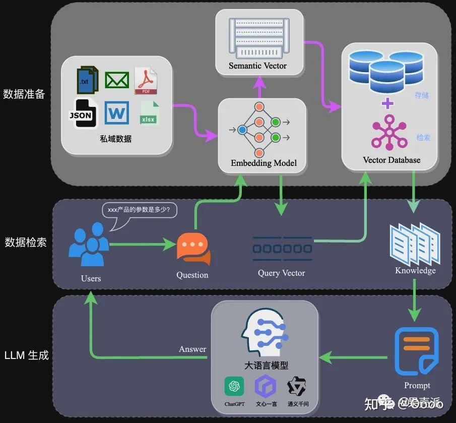

# RAG基础

博客：

1. https://zhuanlan.zhihu.com/p/668082024

论文：

1. [原始RAG架构](https://arxiv.org/abs/2005.11401)

2. [面向生成的检索优化](https://arxiv.org/abs/2002.08909)

3. 检索质量提升

4. 1. [**HyDE**提升零样本检索效果](https://arxiv.org/abs/2212.10496)
   2. [**FLARE**动态判断什么时候需要检索，减少冗余调用](https://arxiv.org/abs/2305.06983)
   3. [**REVEAL**多模态检索](https://arxiv.org/abs/2306.05278)

5. [**Self-RAG**模型自主控制检索时机，并批判性使用检索结果](https://arxiv.org/abs/2310.11511)

6. ```
   先这么多了
   ```

## 简述

RAG的诞生是为了解决知识的局限性以及对于SFT的高昂成本的替代

简单而言是结合数据库，通过向量的余弦相似度的方式，在需要相关知识时，检索相关资料，从而达到增强大模型的能力。



## 数据文本分割：

```
文本分割主要考虑两个要素，1模型的Token限制情况,2分割后的语义完整性
```

1. **句子分割：** 使用句号，感叹号问号等进行分割，可以很大程度上保留语义的完整性
2. 固定长度分割：使用固定的token进行分割，这种方法对于语义有很大的影响，一般采用加入冗余向量的方式来缓解，是极端的考虑token限制的做法

## 文本向量化

``` 
这部分不多解释
```

## 数据入库

数据向量化后构建索引，并写入数据库的过程可以概述为数据入库过程，适用于RAG场景的数据库包括：[FAISS](https://zhida.zhihu.com/search?content_id=236592716&content_type=Article&match_order=1&q=FAISS&zhida_source=entity)、Chromadb、[ES](https://zhida.zhihu.com/search?content_id=236592716&content_type=Article&match_order=1&q=ES&zhida_source=entity)、[milvus](https://zhida.zhihu.com/search?content_id=236592716&content_type=Article&match_order=1&q=milvus&zhida_source=entity)等。一般可以根据业务场景、硬件、性能需求等多因素综合考虑，选择合适的数据库。

## 数据检索

``` 
数据检索使用在大模型使用数据的阶段，检索方法也分为多种
```

1. **相似性检索**：使用向量相似度进行检索，向量相似度的计算方法也有很多种，如/余弦相似度/欧式距离/曼哈顿距离/等
2. **全文检索**：类似于浏览器上使用关键字进行搜索

## 数据拼接

``` 
这一部分在引用的博客似乎没有仔细提及，当时我认为数据的拼接方式也有创新的价值
```

