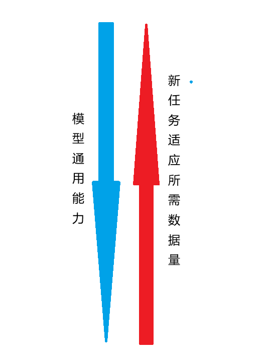
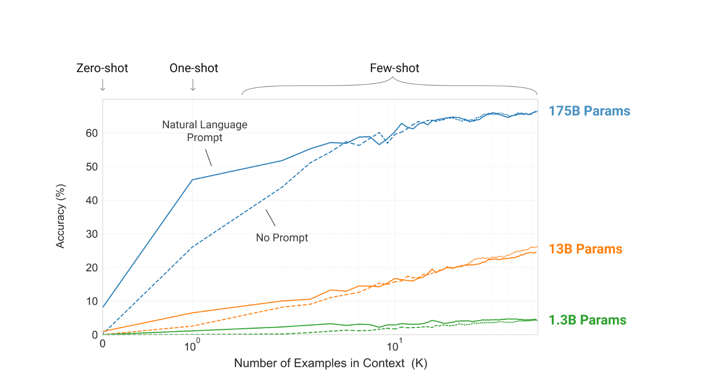

# 任务适应微调

> 任务适应微调可以理解为对于"指令->任务输出"的特化训练。任务适应微调也有很多种方法。

论文：

1. [一个少样本微调GPT3](https://arxiv.org/abs/2005.14165)
2. [T5:标准的使用SFT](https://arxiv.org/abs/1910.10683)
3. [使用适配器层进行微调，而不是微调整个模型](https://arxiv.org/abs/2008.05438)

## 常用方法

1. 监督微调(**SFT**):
   1. 标准的微调方法，利用已经**标注好的数据集**对预训练模型进行微调。这是最常见的微调方式，适用于大部分任务。
2. 少样本微调:
   1. 这里的少样本微调同样是使用**标注好的数据集**，和监督微调的区别在于**标注数据量**和**模型的预训练**
   2. 监督微调对于预训练的依赖较小，而少样本微调因为数据量较小，需要预训练的模型有较好的通用知识。
   3. 少样本数据量较少则为了避免过拟合训练epochs也会较小
3. 无样本:
   1. 其实就是什么都不做，只依赖预训练模型的实力。没什么好说的

对于上面的3个方法，可以得出一个近似却很直观的结论，模型本身的通用能力越强，对于特定任务的训练所需要的数据量也就越少

以人类来举例子，我们通常在学习一个新任务的时候，如果这个新任务所需要的知识在以前的学习中接触过，那么这个任务只需要少量的**示例**就可以做的很出色了。

大模型和人类的一个区别是，大模型进行训练时使用的数据分布十分广泛，涉及的领域相当多。人类在学习自己没有接触过的新任务时，没法做的又快又好。大模型因为数据分布广泛，所以预训练时候的数据越多->通用能力越强->对于一个新任务的处理能力越好->所需的数据量越小

观察上图，横坐标表示特定任务数据量，纵坐标表示准确率，就是在特定任务上的效果。蓝色线表示的是175B的模型，橙色是13B，绿色为1.3B，这里的B表示多少十亿参数->参数越多，模型通用能力也就越强。

**回到目录**：[目录](index.md)